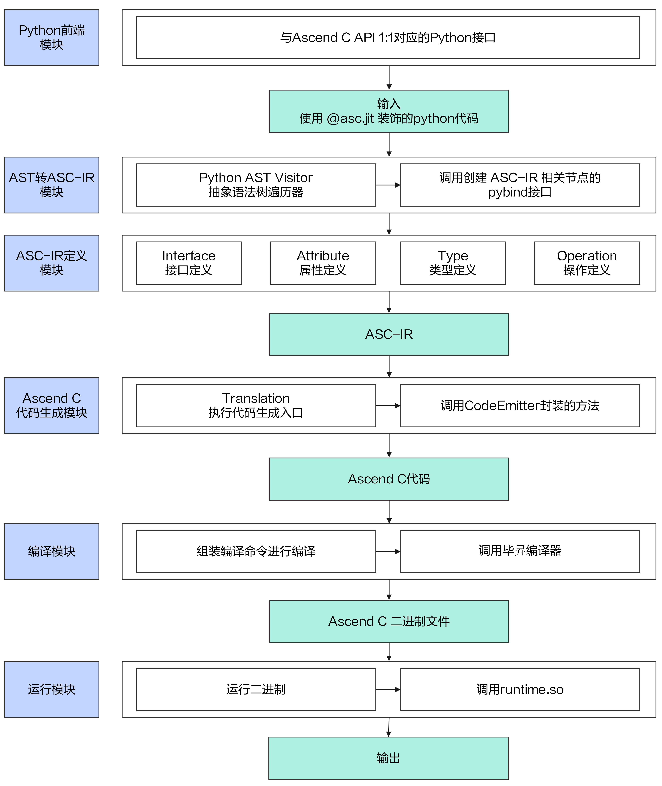

# pyasc模块与架构
## 架构图


## 核心模块关系图


## 核心模块说明

  pyasc项目整体划分为五个核心模块：编译和运行模块、Python前端模块、AST转ASC-IR模块、ASC-IR定义模块、Ascend C代码生成模块，模块之间的关系可参考[核心模块关系图](#核心模块关系图)。其中，编译和运行模块、Python前端模块、AST转ASC-IR模块，可以统称为前端模块；ASC-IR定义模块、Ascend C代码生成模块，可以统称为后端模块。

- 前端模块目录结构说明
    ```
    ├── python                      # python前端代码
    │   ├── asc                       ## 用户可见的python包
    │   │   ├── _C                      ### 占位目录，用于存储后端自动生成的相关py文件
    │   │   ├── codegen                 ### 解析python语法树，生成后端mlir
    │   │   ├── common                  ### 公共代码，例如python版本兼容性接口
    │   │   ├── language                ### 用户编写算子kernel代码所需要的接口，尽量与Ascend C保持一致
    │   │   │   ├── adv                   #### 高阶API，内部文件应该与AscendC高阶API一一对应
    │   │   │   ├── basic                 #### 基础API，内部文件应该与Ascend基础API一一对应
    │   │   │   ├── core                  #### 核心数据结构和枚举，以及python侧新引入的语义
    │   │   │   └── fwk                   #### TPipe/TQue等框架相关的文件
    │   │   ├── lib                     ### 对于c++侧库文件和接口的python封装
    │   │   │   ├── host                  #### 对于Ascend C的Host侧接口的封装
    │   │   │   └── runtime               #### 对于acl runtime接口的封装
    │   │   └── runtime                 ### python前端编译和运行代码
    │   ├── src                       ## pybind相关代码，cpp格式
    │   ├── test                      ## python格式的测试用例集
    │   │   ├── generalization          ### 泛化测试用例，一类接口创建一个端到端的用例进行泛化测试，使用npu或model执行，校验结果正确性
    │   │   ├── kernels                 ### 基础测试用例，一类接口创建一个端到端的用例进行基础测试，使用npu或model执行，校验结果正确性
    │   │   └── unit                    ### 单元测试用例，应该尽量覆盖所有的python api，能够正常生成合法的AscendC代码即可。
    │   │       ├── codegen               #### 测试python/asc/codegen目录下的接口
    │   │       ├── language              #### 测试python/asc/language目录下的接口
    │   │       ├── lib                   #### 测试python/asc/lib目录下的接口
    │   │       └── runtime               #### 测试python/asc/runtime目录下的接口
    │   └── tutorials                 ## 供用户参考的示例代码，需要校验运行结果
    │       ├── 01_add                  ### 手动插入同步流水的Add算子
    │       ├── 02_add_framework        ### 通过Ascend C框架插入流水同步的Add算子
    │       ├── 03_matmul_mix           ### MIX模式（包含矩阵计算和矢量计算）下的Matmul算子
    │       ├── 04_matmul_cube_only     ### 纯Cube模式（只有矩阵计算）的Matmul算子
    │       └── 05_matmul_leakyrelu     ### MatmulLeakyRelu算子
    ```

- 后端模块目录结构说明
    ```
    ├── include                     # 后端头文件和td文件定义
    │   └── ascir                     ## ASC-IR定义头文件和td文件
    │       ├── API                     ### API Type定义
    │       ├── Dialect                 ### 方言定义
    │       │   ├── Asc                   #### Asc方言定义和Pass
    │       │   │   ├── IR                  ##### Asc方言IR定义
    │       │   │   ├── Transforms          ##### Asc相关Pass
    │       │   │   └── Utils               ##### 公共实现
    │       │   ├── EmitAsc              #### 方言转换模块定义
    │       │   │   └── IR                  ##### 方言转换模块IR定义
    │       │   └── Utils               ### 公共实现
    │       └── Target                  ### 代码生成模块
    │           └── Asc                   #### Ascend C代码生成模块
    │               ├── Adv                 ##### 高阶API
    │               ├── Basic               ##### 基础API
    │               ├── Core                ##### 核心数据结构和枚举
    │               ├── External            ##### MLIR方言代码生成
    │               └── Fwk                 ##### TQue等框架类
    ├── lib                       # 后端头文件和td文件实现，以下目录与include目录对应
    │   ├── Dialect
    │   │   ├── Asc
    │   │   │   ├── IR
    │   │   │   ├── Transforms
    │   │   │   └── Utils
    │   │   └── EmitAsc
    │   │       └── IR
    │   ├── TableGen                ## tablegen文件实现
    │   │   └── include
    │   └── Target
    │       └── AscendC
    │           ├── Adv
    │           ├── Basic
    │           ├── Core
    │           ├── External
    │           └── Fwk
    ```


### 编译和运行模块
- 模块功能概述

  - 编译和运行模块通过JIT(Just-In-Time，即时编译)机制拉起，开发者需要导入本项目顶层模块asc，用装饰器@asc.jit修饰核函数和Device侧执行函数，拉起整个编译和运行流程。
  - 核函数（Kernel函数）：由Host侧发起调用，且被@asc.jit修饰的函数；Device侧执行函数：被@asc.jit修饰的除核函数之外的函数，在Device侧被调用。相关的Ascend C定义请参考[《Ascend C编程指南》](https://www.hiascend.com/document/redirect/CANNCommunityOpdevAscendc)中的“核函数”章节。
  - 开发者定义Kernel函数时通过修饰器@asc.jit的小括号()传入编译参数，执行Kernel函数时通过中括号[]传入运行时配置（核数和Stream）。注：Device侧执行函数传递的jit的编译参数是无效的，仅Kernel函数生效。
  - 编译模块通过调用AST转ASC-IR、Ascend C代码生成模块接口，将Python前端代码转换为Ascend C代码，并根据开发者配置的编译参数组装编译命令，基于毕昇编译器生成NPU上可执行的Kernel文件。若开发者需要查看编译过程中生成的ASC-IR和Ascend C代码文件，可通过设置环境变量PYASC_DUMP_PATH=`${dump_path}`设置文件保存路径，在编译完成后切换到该路径下查看生成的文件。同时，编译模块提供JIT编译缓存功能。缓存机制能够存储和复用已经编译的Kernel二进制，避免重复编译，从而提高编译效率和程序执行速度。JIT编译缓存的影响因素包括编译选项、Kernel参数、全局变量以及由@asc.jit修饰的Kernel函数代码等。开发者可通过设置环境变量PYASC_HOME=`${home_path}`设置缓存根目录，默认是当前用户目录，设置环境变量PYASC_CACHE_DIR=`${cache_dir}`设置具体缓存目录，默认值是`${home_path}/.pyasc/cache`。若需要强制开启编译，可设置编译参数always_compile=True。

  - 运行模块解析开发者通过[]传递的运行时配置和Kernel函数的输入输出参数，调用Ascend C Runtime接口加载编译模块生成的Kernel二进制并执行Kernel函数。对于Kernel函数的输入输出位于Host侧的场景，运行模块会自动完成Host侧和Device侧之间的数据拷贝。同时，运行模块支持开发者使用msprof工具采集profiling数据。
- 目录结构说明

    详见[前端目录结构说明](#核心模块说明)。

- 编译参数和运行参数说明

  编译模块仅支持开发者设置以下参数；若未设置，参数kernel_type将由框架自动推导，其余参数项采用默认值。

  | 参数名      | 含义          | 取值范围     |
  | :---        |    :----    |        :--- |
  | kernel_type   | 核函数kernel类型          | asc.runtime.config.KernelType中支持类型  |
  | opt_level   | 毕昇编译器优化级别        | 0,1,2,3      |
  | auto_sync   | 毕昇编译器是否开启自动同步       | True/False      |
  | auto_sync_log   | 保存毕昇编译器同步插入信息的文件   | 开发者自定义文件路径      |
  | matmul_cube_only   | 是否纯Cube模式（只有矩阵计算）  | True/False      |
  | always_compile   | 是否开启强制编译  | True/False      |


  运行模块支持开发者通过[]传递如下运行时配置：
  | 参数名       | 含义          | 取值范围     |   是否必选项    |
  | :---        |    :----      |        :--- |   :--- |
  | core_num    | 运行核数        | 不大于硬件实际可用核数   |  是  |
  | stream      | Kernel执行流        |   | 否|

  编译运行模块调用示例：
  ```python
  import asc
  import asc.runtime.config as config
  import asc.lib.runtime as rt
  @asc.jit(kernel_type=config.KernelType.AIC_ONLY)
  def kernel_func(*params):
      do_something

  def global_func(*global_params):
      do_something
      kernel_params=xxx
      kernel_func[1, rt.current_stream()](kernel_params)
      do_something
  ```

### Python前端模块
- 模块功能概述

    Python前端模块提供与Ascend C API接口一一对应的Python编程接口，旨在向Python用户提供完备的芯片开发能力。

- 目录结构说明

    详见[前端目录结构说明](#核心模块说明)。与Ascend C的接口分类相同，Python前端接口分为高阶API、基础API、核心数据结构和枚举、同步和内存管理框架类接口四类，位于`python/asc/language`目录下。

- Python接口使用注意事项

    - 数据类型

        由于python变量本身无类型，需要指明类型时可使用`asc.int64`或`asc.float32`等。函数或属性支持的数据类型与Ascend C一致。

        ```
        x_local = in_queue_x.alloc_tensor(asc.float32)  # 表示从Que中分配数据类型为float32的Tensor
        ```

    - 常量表示

        在接口中，某些参数需要作为常量表达式传递，可使用`asc.ConstExpr[origin_type]`泛型标记（会在最终翻译生成的Ascend C代码中生效），表明参数为常量。例如以下代码中`BUFFER_NUM`和`TILE_LENGTH`为常量。

        ```python
        def vadd_kernel(x: asc.GlobalAddress, y: asc.GlobalAddress, z: asc.GlobalAddress, block_length: int,
                        BUFFER_NUM: asc.ConstExpr[int], TILE_LENGTH: asc.ConstExpr[int]):
        ```

    - 枚举类型

        通过asc.枚举类.枚举值的方式使用枚举类型的值，避免使用未定义的枚举值，防止运行时错误。以枚举类型Position中的枚举值VECIN为例，代码如下：

        ```python
        in_queue_x = asc.TQue(asc.TPosition.VECIN, BUFFER_NUM)
        ```

    - 参数映射

        Python接口与Ascend C接口1:1对应，对于接口参数，按照以下顺序映射：运行时必选参数，模板必选参数，运行时可选参数，模板可选参数。例如：


        Ascend C接口定义如下：
        ```cpp
        tempate <typename T, bool tplRequire, bool tplOptional = false>
        __aicore__ inline void Func(const LocalTensor<T>& rtRequire, int32_t rtOptional=128);
        ```

        按照上述参数顺序规则，对应的Python前端接口定义如下：
        ```python
        def func(rt_require: LocalTensor, tpl_require: bool, rt_optional: int = 128, tpl_optional: bool = False):...
        ```

        对于GlobalTensor和LocalTensor的数据类型，将DataType作为Tensor的成员变量。例如：
        ```python
        x_local = asc.LocalTensor(asc.float32, asc.TPosition.VECIN, 0, TILE_LENGTH * BUFFER_NUM) # 类型作为第一个变量传入
        ```

### AST转ASC-IR模块

- 模块功能概述

  本模块主要完成将Python AST（Abstract Syntax Tree，抽象语法树）转换为ASC-IR（AscendC-IR，Ascend C中间表示）的功能。本模块由JIT编译模块调用，输入Python源码及对应AST结构内容、参数、变量和相关配置等，在模块内进行转换处理，生成对应的ASC-IR，作为后续Ascend C代码生成模块的输入。

  本模块的核心是AST语法树遍历，根据不同的AST节点类型，调用不同的处理接口生成对应的IR代码行，并合理控制生成整体IR的结构。由于ASC-IR定义及创建IR的接口均在C++侧，因此本模块利用pybind11机制为ASC-IR生成接口提供对应Python调用接口。同时本模块使用TableGen工具自动生成Ascend C相关的pybind绑定定义。

- 目录结构说明

  详见[前端目录结构说明](#核心模块说明)。  
  模块入口代码文件：`python\asc\codegen\function_visitor.py`。

- 约束

  - 不支持的Python语法结构列表：

    请参见[pyasc不支持的语法接口列表](python_syntax_support.md#不支持的语法接口列表)

  - 参数约束

    - 支持的输入参数类型  
      布尔类型（bool）、整数类型（int）、浮点数类型（float）、NumPy标量（np.generic）、NumPy数组（np.ndarray）、模拟张量（MockTensor）、模拟值（MockValue）、张量（torch.Tensor）。
    - 不支持的输入参数类型  
      不在上述支持范围内的参数类型均不支持，比如字符串（str）、元组（tuple）、列表（list）和字典（dict）等。不支持的类型是指无法作为运行时参数，但是可通过asc.ConstExpr作为编译时参数传递，用于assert和其他编译时语句。
    - 模拟张量（MockTensor）、模拟值（MockValue）一般用于调试开发，不在实际代码中使用。
    
  - 函数使用约束

    - 仅支持Python原生内置函数，当前允许使用的范围为：dict、float、int、isinstance、issubclass、len、list、range、repr、str、tuple、type。
    - 不支持任何非上述指定的函数，包括Python标准库函数及第三方库函数。

### ASC-IR定义模块
- 模块功能概述   
  ASC-IR是基于[MLIR](https://mlir.llvm.org/)（Multi-Level Intermediate Representation）定义的Dialect。

  设计目标包含：   
  - 实现1:1映射Ascend C API。 
  - 可直接由Python代码通过JIT编译生成Ascend C代码。 

  ASC Dialect由Type，Attribute，Interfaces，Operation构成。具体说明如下：
  - Type  
    类型定义。继承MLIR的TypeDef基类，实现了LocalTensor、GlobalTensor、TQue、TBuf等类型的定义。
  - Attribute  
    属性定义。包含Ascend C中关于Layout、Format、Event枚举类型属性等的定义。
  - Interfaces  
    接口定义。包含API Interface和Type Interface。API Interface为所有Operation类提供统一接口，例如getAPIName接口获取Ascend C API的函数名、getComment接口获取IR的注释等。Type Interface提供基础数据类型的统一接口。  
  - Operation    
    操作定义。继承MLIR的Op基类，主要提供APIOp类对应的Ascend C API操作。包含TPipe、TQue、VecOp、SetFlag、WaitFlag以及高阶API接口的操作的定义。   

  本模块主要功能为将Python前端接口的参数列表映射成Operation类的参数arguments。映射规则：
  - 类型模板参数不需映射在IR中，非类型模板参数放在函数参数后。
  - 参数的整体顺序为：运行时必选参数，模板必选参数，运行时可选参数，模板可选参数。参数名建议和Ascend C API保持一致。  

- 目录结构说明

  详见[后端目录结构说明](#核心模块说明)。


- 约束   
  ASC-IR中的Operation类命名规则：Dialect + 下划线 + Ascend C类名 + 成员函数。

### Ascend C代码生成模块
- 模块功能概述   
  本模块的核心功能是实现 MLIR 中间表示（ASC-IR）到 Ascend C 代码的转换逻辑。  
  本模块主要负责解析 ASC-IR 中的各种结构，并将其映射为等价的Ascend C语法结构，如基础API接口、高阶API接口。

- 目录结构说明

  详见[后端目录结构说明](#核心模块说明)。
