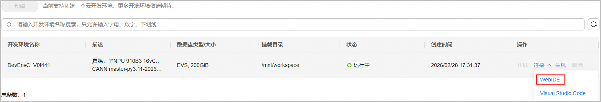

# 快速开始
## 🛠️ 环境准备<a name="envready"></a>

根据**本地是否有NPU设备**和**使用目标**选择对应的环境准备方式：

<table border="1" cellpadding="8" cellspacing="0">
  <thead>
    <tr>
      <th style="text-align: center; vertical-align: middle;">环境准备</th>
      <th style="text-align: center; vertical-align: middle;">社区体验 / 算子开发(CANN商用/社区版)</th>
      <th style="text-align: center; vertical-align: middle;">生态开发者贡献(CANN master)</th>
    </tr>
  </thead>
  <tbody>
    <tr>
      <td style="text-align: center; vertical-align: middle;"><strong>无NPU设备</strong></td>
      <td style="text-align: center; vertical-align: middle;" colspan="2"><a href="#3️⃣-下载安装cann包">手动下载安装CANN master</a> + <a href="#1️⃣-云开发环境">云开发环境</a></td>
    </tr>
    <tr>
      <td style="text-align: center; vertical-align: middle;"><strong>有NPU设备</strong></td>
      <td style="text-align: center; vertical-align: middle;"><a href="#2️⃣-cann官方docker镜像">CANN官方Docker镜像</a></td>
      <td style="text-align: center; vertical-align: middle;"><a href="#3️⃣-下载安装cann包">手动下载安装CANN master</a></td>
    </tr>
  </tbody>
</table>

> [!TIP] 选择建议
>
> - 为了保障开发体验环境的质量，推荐用户基于**容器化技术**完成**环境准备**。
> - 如不希望使用容器，也可在带NPU设备的主机上完成**环境准备**，请参考[CANN软件安装指南 - 在物理机上安装](https://www.hiascend.com/document/redirect/CannCommunityInstWizard)。
> - 针对仅体验"编译安装本开源仓 + 仿真环境运行算子"的用户，不要求主机带NPU设备，可跳过安装NPU驱动和固件，直接安装CANN包，请参考[下载安装CANN包](#3️⃣-下载安装cann包)。


### 1️⃣ 云开发环境

对于无NPU设备的用户，可使用**云开发环境**提供的NPU计算资源进行开发体验，**云开发环境**提供了在线直接运行的昇腾ARM架构环境。目前仅适用于Atlas A2系列产品，提供两种接入方式：

- **WebIDE开发平台**，即"**一站式开发平台**"，提供网页版的便携开发体验。
- **VSCode IDE**，支持远程连接**云开发环境**，提供VSCode强大插件市场的支持。

1. 进入开源仓Gitcode页面，单击"`云开发`"按钮，使用已认证过的华为云账号登录。若未注册或认证，请根据页面提示进行注册和认证。

   

2. 根据页面提示创建并启动云开发环境，单击"`连接 > WebIDE 或 Visual Studio Code`"进入云开发环境，开源项目的资源默认在`/mnt/workspace`目录下。

   

> [!NOTE] 使用说明
>
> - 环境默认安装了最新的商用版NPU驱动和固件、CANN包，源码下载时注意与软件配套。
> - 本仓建议用户在WebIDE平台上使用CANN master软件包，请参考[下载安装CANN包](#3️⃣-下载安装cann包)。如用户已更新过CANN软件包则无需重新安装。
> - 更多关于**WebIDE开发平台**的介绍，请参考[云开发平台介绍](https://gitcode.com/org/cann/discussions/54)。
> - [Huawei Developer Space插件](https://marketplace.visualstudio.com/items?itemName=HuaweiCloud.developerspace)为VSCode IDE接入**云开发环境**提供技术支持。

### 2️⃣ CANN官方Docker镜像

对于有NPU设备的用户，可使用CANN官方Docker镜像进行开发体验。

1. 确认主机环境

   - 是否已安装NPU驱动和固件，使用`npu-smi info`能够输出NPU相关信息，如没有安装，请参考[CANN软件安装指南 - 在物理机上安装](https://www.hiascend.com/document/redirect/CannCommunityInstWizard)。
   - 是否已安装Docker，使用`docker --version`能够输出Docker版本信息，如没有安装，请参考[Docker官方安装指南](https://docs.docker.com/engine/install/)。

2. 下载CANN镜像

    从[昇腾镜像仓库](https://www.hiascend.com/developer/ascendhub/detail/17da20d1c2b6493cb38765adeba85884)拉取已预集成CANN镜像：

    ```bash
    # 示例：ascend/cann:tag为9.0.0-beta.2的CANN社区包
    # docker pull swr.cn-south-1.myhuaweicloud.com/ascendhub/cann:9.0.0-beta.2-910b-ubuntu22.04-py3.11
    docker pull <ascend/cann:tag>
    ```

    > [!NOTE] 使用说明
    > - 镜像默认安装了对应版本的CANN包，源码下载时注意与软件配套。
    > - 镜像文件比较大，正常网速下，下载时间约为5～10分钟，请您耐心等待。

3. 运行Docker

    拉取镜像后，需要以特定参数启动，以便容器内能访问宿主机的NPU设备。

    ```bash
    docker run --name <cann_container> \
        --ipc=host --net=host --privileged \
        --device /dev/davinci0 \
        --device /dev/davinci_manager \
        --device /dev/devmm_svm \
        --device /dev/hisi_hdc \
        -v /usr/local/dcmi:/usr/local/dcmi \
        -v /usr/local/bin/npu-smi:/usr/local/bin/npu-smi \
        -v /usr/local/Ascend/driver/lib64/:/usr/local/Ascend/driver/lib64/ \
        -v /usr/local/Ascend/driver/version.info:/usr/local/Ascend/driver/version.info \
        -v /etc/ascend_install.info:/etc/ascend_install.info \
        -v </home/your_host_dir>:</home/your_container_dir> \
        -it <ascend/cann:tag> bash
    ```

    | 参数 | 说明 | 注意事项 |
    | :--- | :--- | :--- |
    | `--name <cann_container>` | 为容器指定名称，便于管理 | 自定义 |
    | `--ipc=host` | 与宿主机共享IPC命名空间，NPU进程间通信（共享内存、信号量）所需 | - |
    | `--net=host` | 使用宿主机网络栈，避免容器网络转发带来的通信延迟 | - |
    | `--privileged` | 赋予容器完整设备访问权限，NPU驱动正常工作所需 | - |
    | `--device /dev/davinci0` | 将宿主机的NPU设备卡映射到容器内，可指定映射多张NPU设备卡 | 必须根据实际情况调整：`davinci0`对应系统中的第0张NPU卡。请先在宿主机执行`npu-smi info`命令，根据输出显示的设备号（如`NPU 0`, `NPU 1`）来修改此编号 |
    | `--device /dev/davinci_manager` | 映射NPU设备管理接口 | - |
    | `--device /dev/devmm_svm` | 映射设备内存管理接口 | - |
    | `--device /dev/hisi_hdc` | 映射主机与设备间的通信接口 | - |
    | `-v /usr/local/dcmi:/usr/local/dcmi` | 挂载设备容器管理接口（DCMI）相关工具和库 | - |
    | `-v /usr/local/bin/npu-smi:/usr/local/bin/npu-smi` | 挂载`npu-smi`工具 | 使容器内可以直接运行此命令来查询NPU状态和性能信息 |
    | `-v /usr/local/Ascend/driver/lib64/:/usr/local/Ascend/driver/lib64/` | 将宿主机的NPU驱动库映射到容器内 | - |
    | `-v /usr/local/Ascend/driver/version.info:/usr/local/Ascend/driver/version.info` | 挂载驱动版本信息文件 | - |
    | `-v /etc/ascend_install.info:/etc/ascend_install.info` | 挂载CANN软件安装信息文件 | - |
    | `-v </home/your_host_dir>:</home/your_container_dir>` | 挂载宿主机的一个路径到容器中 | 自定义 |
    | `-it` | `-i`（交互式）和`-t`（分配伪终端）的组合参数 | - |
    | `<ascend/cann:tag>` | 指定要运行的Docker镜像 | 请确保此镜像名和标签（tag）与您通过`docker pull`拉取的镜像完全一致 |
    | `bash` | 容器启动后立即执行的命令 | - |

### 3️⃣ 下载安装CANN包<a name=canninstall></a>

若您需要手动安装软件包，请按照如下步骤选择正确的版本进行安装。

使用[基于源码安装](#⚡-pyasc基于源码安装)时，建议安装社区版<a href="https://www.hiascend.com/developer/download/community/result?module=cann&cann=8.5.0.alpha001">8.5.0.alpha001</a>及以上版本。

使用[快速安装](#⚡-pyasc快速安装)时，不同pyasc发行版可支持的硬件平台及所需的[CANN](https://www.hiascend.com/developer/download/community/result?module=cann)版本如下表：

<table style="width: 75%; margin: 0 auto;">
  <colgroup>
    <col style="width: 25%">
    <col style="width: 22%">
    <col style="width: 22%">
  </colgroup>
  <thead>
      <tr>
          <th>pyasc社区版本</th>
          <th>支持CANN包版本</th>
          <th>支持昇腾产品</th>
      </tr>
  </thead>
  <tbody style="text-align: center">
      <tr>
 	           <td>v1.1.0、v1.1.1</td>
 	           <td>社区版<a href="https://www.hiascend.com/developer/download/community/result?module=cann&cann=8.5.0.alpha001">8.5.0.alpha001</a>及以上</td>
 	           <td><a href="https://www.hiascend.com/document/detail/zh/AscendFAQ/ProduTech/productform/hardwaredesc_0001.html">Atlas A2训练/推理产品</a> <br>
 	           <a href="https://www.hiascend.com/document/detail/zh/AscendFAQ/ProduTech/productform/hardwaredesc_0001.html">Atlas A3训练/推理产品</a></td>
 	       </tr>
      <tr>
          <td>v1.0.0</td>
          <td>社区版<a href="https://www.hiascend.com/developer/download/community/result?module=cann&cann=8.5.0.alpha001">8.5.0.alpha001</a>、<a href="https://www.hiascend.com/developer/download/community/result?module=cann&cann=8.5.0.alpha002">8.5.0.alpha002</a></td>
          <td><a href="https://www.hiascend.com/document/detail/zh/AscendFAQ/ProduTech/productform/hardwaredesc_0001.html">Atlas A2训练/推理产品</a> <br>
          <a href="https://www.hiascend.com/document/detail/zh/AscendFAQ/ProduTech/productform/hardwaredesc_0001.html">Atlas A3训练/推理产品</a></td>
      </tr>
  </tbody>
</table>

CANN包分为CANN toolkit包和CANN ops包。

#### 下载CANN包

1. <a name="下载-cann-商用社区版"></a>下载CANN商用/社区版

    如果您想体验**官网正式发布的CANN包**，请访问[CANN安装部署-昇腾社区](https://www.hiascend.com/cann/download)获取对应版本CANN包。

2. <a name="下载-cann-master"></a>下载CANN master

    如果您想体验**CANN master**，请访问[CANN master obs镜像网站](https://ascend.devcloud.huaweicloud.com/artifactory/cann-run-mirror/software/master)，下载**日期最新**的CANN包。

#### 安装CANN包

1. 安装CANN toolkit包 (必选)

    ```bash
    chmod +x Ascend-cann-toolkit_${cann_version}_linux-$(uname -m).run
    ./Ascend-cann-toolkit_${cann_version}_linux-$(uname -m).run --install --install-path=${install_path}
    ```

2. 安装CANN ops包 (可选)

    ```bash
    # 示例：在x86架构下的8.5.0版本ops包
    # 910B为Ascend-cann-910b-ops_8.5.0_linux-x86_64.run
    # 910C为Ascend-cann-A3-ops_8.5.0_linux-x86_64.run
    chmod +x Ascend-cann-${soc_name}-ops_${cann_version}_linux-$(uname -m).run
    ./Ascend-cann-${soc_name}-ops_${cann_version}_linux-$(uname -m).run --install --install-path=${install_path}
    ```

    > [!IMPORTANT] 安装说明
    > [tutorials](../python/tutorials/)中部分算子样例的编译运行依赖本包，若想完整体验样例编译运行流程，建议安装此包。

## ✅ 环境验证

> [!NOTE] 使用前须知
> 云开发环境和CANN官方Docker镜像已预装CANN包，可直接执行以下命令验证；手动安装用户请在安装CANN包后执行。

验证环境和驱动是否正常：

- **检查NPU设备**：

    ```bash
    # 运行npu-smi，若能正常显示设备信息，则驱动正常
    npu-smi info
    ```

- **检查CANN包安装**：
  
    ```bash
    # 查看CANN包的version字段提供的版本信息（默认路径安装）。WebIDE场景下，请将/usr/local替换为/home/developer
    cat /usr/local/Ascend/cann/$(uname -m)-linux/ascend_toolkit_install.info
    cat /usr/local/Ascend/cann/$(uname -m)-linux/ascend_ops_install.info
    ```

## ⚙️ 环境变量配置

> [!NOTE] 使用前须知
> 云开发环境和CANN官方Docker镜像已自动配置环境变量，可跳过此步骤。
> 若在环境中手动更新CANN包，请按照如下步骤重新配置环境变量。

按需选择合适的命令使环境变量生效：

```bash
# 默认路径安装，以root用户为例（非root用户，将/usr/local替换为${HOME}）
source /usr/local/Ascend/cann/set_env.sh
# 指定路径安装
# source ${install_path}/cann/set_env.sh
```

注1：当pyasc后端采用仿真器模式（如Ascend910B1 simulator）时，需设置以下环境变量：
```bash
export LD_LIBRARY_PATH=$ASCEND_HOME_PATH/tools/simulator/Ascend910B1/lib:$LD_LIBRARY_PATH
```

注2：若pyasc后端采用仿真器模式运行接入torch的算子，需要提前加载仿真动态库libruntime_camodel.so。（原因：torch_npu默认只支持NPU上板，并且在导入torch_npu时自动加载libruntime.so，仿真器模式运行需要提前加载libruntime_camodel.so）。
```bash
# 若pyasc后端采用仿真器模式，需设置LD_PRELOAD环境变量
export LD_PRELOAD=libruntime_camodel.so
# 若pyasc后端采用NPU处理器运行，需取消LD_PRELOAD环境变量
unset LD_PRELOAD
```

**注意：若环境中已安装多个版本的CANN软件包，设置上述环境变量时，请确保${cann_install_path}目录指向的是配套版本的软件包。**

## 🔨 pyasc安装<a name="buildenv"></a>

pyasc支持通过pip快速安装和基于源码编译安装两种方式。

### 📥 下载源码

开发者可通过如下命令下载本仓源码：

```bash
# 下载项目源码，以master分支为例
git clone https://gitcode.com/cann/pyasc.git
cd pyasc
```

### ⚡ python依赖安装
执行以下命令完成编译运行需要的python依赖安装：
```bash
python3 -m pip install -r requirements-build.txt # build-time dependencies
python3 -m pip install -r requirements-runtime.txt # run-time dependencies
```

### 📦 依赖检查

> [!NOTE] 使用前须知
> 如您使用**容器化技术**，容器中已为您安装好依赖，可跳过此步骤。

以下为本开源仓源码编译和样例运行的基础依赖条件：

- python >= 3.9.0, python <= 3.12
- GCC >= 9.4.0
- GLIBC >= 2.31
- cmake >= 3.20

### ⚡ pyasc快速安装
您可以通过pip安装pyasc的最新稳定版本：
```bash
pip install pyasc
```
二进制wheel安装包支持CPython 3.9-3.12。

### ⚡ pyasc基于源码安装

- 安装LLVM<a name="llvm_build"></a>

   1. 下载LLVM预编译包：根据系统架构选择对应命令：

      ```bash
      # 示例：下载ARM架构的LLVM预编译包
      wget https://cann-ai.obs.cn-north-4.myhuaweicloud.com/llvm/LLVM-19.1.7-aarch64.tar.xz
      tar -xJf LLVM-19.1.7-aarch64.tar.xz
      export LLVM_INSTALL_PREFIX=$PWD/LLVM-19.1.7-aarch64
      # 示例：下载X86架构的LLVM预编译包
      wget https://cann-ai.obs.cn-north-4.myhuaweicloud.com/llvm/llvm-19.1.7-x86_64.tar.xz
      tar -xJf llvm-19.1.7-x86_64.tar.xz
      export LLVM_INSTALL_PREFIX=$PWD/llvm-19.1.7-x86_64
      ```
   2. 验证安装：执行以下命令，若输出对应版本信息，说明安装成功：

      ```bash
      ${LLVM_INSTALL_PREFIX}/bin/llvm-config --version
      ```

- 构建pyasc
   1. 进入上文下载的pyasc源码目录。
      ```shell
      cd pyasc
      ```
   2. 设置环境变量，`${llvm_install_path}`为下载的LLVM预编译包路径。
      ```shell
      export LLVM_INSTALL_PREFIX=${llvm_install_path}
      ```
   3. 执行以下命令进行构建和安装：
      ```shell
      # 普通模式，将项目安装到Python环境的site-packages目录中，本地修改不影响已安装版本，适用于生产环境
      python3 -m pip install .
      # 开发者模式，仅创建符号链接，本地修改实时生效，无需重新安装，适用于开发阶段
      python3 -m pip install -e .
      ```

## ▶️ 样例运行验证

开发者使用Ascend C Python编程语言实现自定义算子后，可以进行算子功能验证。本代码仓提供了部分算子实现的样例，具体请参考[tutorials](../python/tutorials/)目录下的样例，样例均采用torch输入输出tensor，请确保已经完成[安装PyTorch框架和torch_npu插件](#torch_install)步骤和[环境变量配置](#⚙️-环境变量配置)步骤。

- 安装PyTorch框架和torch_npu插件<a name="torch_install"></a>

   使用[云开发环境](#1️⃣-云开发环境)可跳过此步骤。
   
   编译运行torch输入输出tensor的算子时必须安装本包。本代码仓提供一键式安装脚本，默认安装`PyTorch2.7.1`，`torch_npu7.3.0`，若需要安装其他版本或脚本安装失败请自行手动安装。

   方式一：进入上文下载的pyasc仓，执行如下命令：
   ```bash
   cd pyasc
   bash torch_npu_install.sh
   ```

   方式二：手动安装

   根据实际环境，选择对应的版本进行安装，具体可以查看[Ascend Extension for PyTorch文档](https://www.hiascend.com/document/detail/zh/Pytorch/730/configandinstg/instg/docs/zh/installation_guide/installation_via_binary_package.md)。

   以`Python3.9`，`x86_64`，`PyTorch2.7.1`，`torch_npu7.3.0`版本为例。
   - 安装`PyTorch`框架：
      ```bash
      # 下载软件包
      wget https://download.pytorch.org/whl/cpu/torch-2.7.1%2Bcpu-cp39-cp39-manylinux_2_28_x86_64.whl
      # 安装命令
      pip3 install torch-2.7.1+cpu-cp39-cp39-manylinux_2_28_x86_64.whl
      ```
   - 安装`torch_npu`插件，若仅在仿真器模式运行可跳过该步骤：
      ```bash
      # 下载插件包
      wget https://gitcode.com/Ascend/pytorch/releases/download/v7.3.0-pytorch2.7.1/torch_npu-2.7.1.post2-cp39-cp39-manylinux_2_28_x86_64.whl
      # 安装命令
      pip3 install torch_npu-2.7.1.post2-cp39-cp39-manylinux_2_28_x86_64.whl
      ```

- 运行样例

   以Add算子为例，执行如下命令可进行功能验证。
   ```bash
   cd pyasc
   python3 ./python/tutorials/01_add/add.py
   ```
   注：完整的运行命令如下所示，通过参数[RUN_MODE]配置运行模式、参数[SOC_VERSION]配置运行环境，具体请参考[编译执行](../python/tutorials/01_add/README.md/#编译执行)。若缺省参数[RUN_MODE]默认是仿真器模式，缺省参数[SOC_VERSION]，仿真器模式下默认是`Ascend910B1`环境，NPU上板模式下默认自动检测。
   ```bash
   python3 ./python/tutorials/01_add/add.py -r [RUN_MODE] -v [SOC_VERSION]
   ```

## 🧪 UT测试
本代码仓支持开发者对开发内容进行UT测试。在执行UT测试前，请确保环境已[构建安装LLVM](#llvm_build)并且已安装Python测试框架pytest。pytest安装命令如下：
```bash
pip install pytest
```

### Python模块UT测试
在项目根目录下，执行如下命令可进行Python模块的UT单元测试验证。其中，`${llvm_install_path}`为上文描述的LLVM安装路径。
```bash
cd test
bash build_llt.sh --run_python_ut --llvm_install_path ${llvm_install_path}
```
在项目根目录下，执行如下命令，可在执行UT测试后使用pytest-cov工具生成代码覆盖率报告。具体为，test目录下自动生成HTML报告，打开该文件即可查看详细覆盖率信息，Python前端模块报告在cov_py文件夹下。
```bash
cd test
pip install pytest-cov
bash build_llt.sh --cov --run_python_ut --llvm_install_path ${llvm_install_path}
```

### ASC-IR定义模块UT测试
在执行ASC-IR定义模块的UT测试前，请确保环境已安装[lit](https://llvm.org/docs/CommandGuide/lit.html)工具。安装命令如下：
```bash
pip install lit
```

在项目根目录下，执行如下命令可进行ASC-IR定义模块的UT单元测试验证。其中，`${llvm_install_path}`为LLVM安装路径，`${lit_install_path}`为lit安装路径。  
注：lit工具位于安装路径`${lit_install_path}`的bin目录下。
```bash
cd test
bash build_llt.sh --check-ascir --llvm_install_path ${llvm_install_path} --lit_install_path ${lit_install_path}
```

**编译器选择说明**：
- **默认编译器**：默认使用GCC编译，适用于无Clang环境
- **Clang编译**：使用`--clang`参数可启用Clang编译，编译效率更高。需确保环境已安装clang和lld（推荐版本clang>=15，lld>=15）
```bash
bash build_llt.sh --clang --check-ascir --llvm_install_path ${llvm_install_path} --lit_install_path ${lit_install_path}
```

在项目根目录下，执行如下命令，可在执行UT测试后使用LCOV工具生成代码覆盖率报告。具体为，test目录下自动生成HTML报告，打开该文件即可查看详细覆盖率信息，ASC-IR定义模块报告在cov_ascir文件夹下。
```bash
cd test
sudo apt install lcov
bash build_llt.sh --cov --check-ascir --llvm_install_path ${llvm_install_path} --lit_install_path ${lit_install_path}
```

**Clang覆盖率说明**：若使用`--clang`参数编译并生成覆盖率，需额外安装llvm-profdata和llvm-cov工具（推荐版本llvm-profdata-15，llvm-cov-15）
```bash
bash build_llt.sh --clang --cov --check-ascir --llvm_install_path ${llvm_install_path} --lit_install_path ${lit_install_path}
```